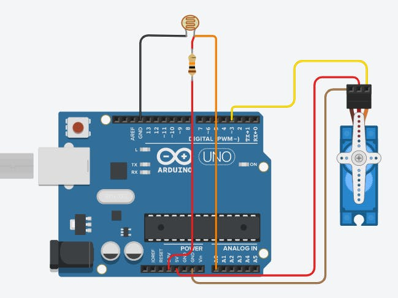

# miPrimerServo
Mi primer servo controlado con Arduino

## Descripción de funcionamiento

Este proyecto consistirá en conectar un LDR que controle el movimiento de un Servomotor

### Código

~~~
#include <Servo.h>
int ldrPin = A0;

int intensidad = 0; //guarda la cantidad de luz
int intensidadMapeada = 0; //guardar la cantidad de luz 
//despues de ajustarla al rango del servo
int servoMax = 150;
int servoMin = 30;
Servo miServo1;  
int pos = 0;   

void setup() {
  miServo1.attach(3);  
}

void loop() {
    intensidad = analogRead(A0);
    intensidadMapeada = map(intensidad, 0, 1023, servoMin,servoMax);
    pos = intensidadMapeada;
    //qué variable va a escribir en mi servo
    miServo1.write(pos);            

}
~~~

toDo: subir esquemático

##  Imagen de referencia (extraída de google)

La estructura para subir images es !, seguido de titulo de imagen entre corchetes [, y finaliza con la ruta del archivo entre paréntesis

ejemplo:

